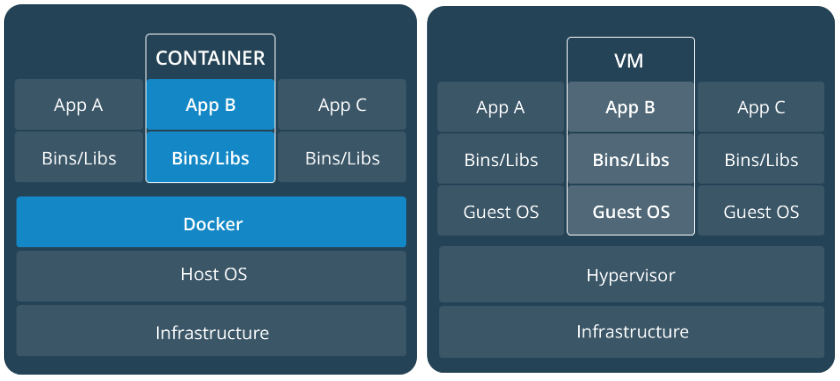
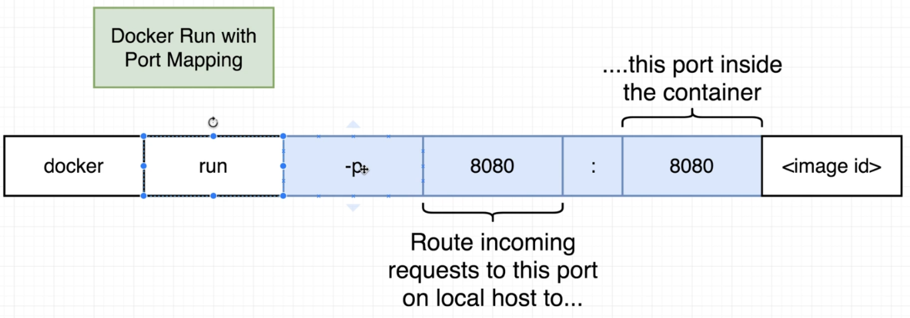

<h1 align="center">Docker : Getting Started 🚀</h1>
<p align="center">

</p>

## 🤔 what?

> Docker is a software platform that allows you to build, test, and deploy applications quickly. Docker packages software into standardized units called containers that have everything the software needs to run including libraries, system tools, code, and runtime. Using Docker, you can quickly deploy and scale applications into any environment and know your code will run.

## 🤔 why?

> Docker provides us with containers. And containerization consists of an entire runtime environment, an application, all its dependencies, libraries, binaries and configuration files needed to run it, bundled into one package. Each application runs separately from the other. Docker solves the dependency problem by keeping the dependency contained inside the containers. It unites developers against dependency of their project. Docker-based applications can be seamlessly moved from local development machines to production deployments.

## 🤔 how?

> Docker works by providing a standard way to run your code. Docker is an operating system for containers. Similar to how a virtual machine virtualize (removes the need to directly manage) server hardware, containers virtualize the operating system of a server. Docker is installed on each server and provides simple commands you can use to build, start, or stop containers.
> 

## 📃 Docker Daily use commands

### Show commands & management commands

```sh
$ docker
```

### Docker version info

```sh
$ docker version
```

### Show info like number of containers, etc

```sh
$ docker info
```

> 💡 NOTE: Docker is based on `Go` language.

## Working with Container

### Create an run a container in foreground

```sh
$ docker run -it redis
```

### Create and run a container in background

```sh
$ docker run -d redis
```

> 💡 NOTE: WHAT `run` DID?
>
> - Looked for image called redis in image cache
> - If not found in cache, it looks to the default image repo on Docker hub
> - Pulled it down (latest version), stored in the image cache
> - Started it in a new container
> - `docker run` = `docker create` + `docker start`

> 💡 NOTE: Analogy to understand image and container: Consider image like blueprint and container like an actual house, we can't build the house without blueprint thus need to download image. Container is like running instance of image which got created in the system.

### List running containers

```sh
$ docker ps
```

### List all containers (Even if not running)

```sh
$ docker ps -a
```

> 💡 NOTE: If we are not giving any specific name to our container, it randomly generate one, with first segment adjective and second segment famous hacker/scientist name.

### Stop container

```sh
$ docker stop <CONTAINER_ID>
```

### Stop all running containers

```
$ docker stop $(docker ps -aq)
```

### Force stop container

```sh
docker kill <CONTAINER_ID>
```

### Remove container (Can not remove running containers, must stop first)

```sh
$ docker rm <CONTAINER_ID>
```

### To remove a running container use force(-f)

```sh
$ docker rm -f <CONTAINER_ID>
```

### Remove multiple containers

```sh
$ docker rm <CONTAINER_ID_1> <CONTAINER_ID_2> <CONTAINER_ID_3>
```

### Remove all containers

```sh
$ docker rm $(docker ps -aq)
```

### Get logs (Use name or ID)

```sh
$ docker container logs <CONTAINER_NAME>
```

### List processes running in container

```sh
$ docker top <CONTAINER_NAME>
```

> 💡 NOTE: ABOUT CONTAINERS - Docker containers are often compared to virtual machines but they are actually just processes running on your host `OS`. In Windows/Mac, Docker runs in a mini-VM so to see the processes you'll need to connect directly to that. On Linux however you can run "ps aux" and see the processes directly.

### View info on container

```sh
$ docker container inspect <CONTAINER_NAME>
```

### Specific property (--format)

```sh
$ docker container inspect --format '{{ .NetworkSettings.IPAddress }}' <CONTAINER_NAME>
```

### Performance stats (cpu, mem, network, disk, etc)

```sh
$ docker container stats <CONTAINER_NAME>
```

## Working with IMAGE

### List the images we have pulled

```sh
$ docker image ls
```

### We can also just pull down images

```
$ docker pull <IMAGE_NAME>
```

> 💡 NOTE: Even after removing container, image still exists. IMAGE needs to removed separately.

### Remove image

```
$ docker image rm <IMAGE_NAME>
```

### Remove all images

```
$ docker rmi $(docker images -a -q)
```

> 💡 NOTE: About IMAGE
>
> - Images are app binaries and dependencies with meta data about the image data and how to run the image
> - Images are no a complete OS. No kernel, kernel modules (drivers)
> - Host provides the kernel, big difference between VM

### Some sample container creation

#### NGINX:

```sh
# -p 80:80 is optional as it runs on 80 by default
# -d :- To run container in background
$ docker container run -d -p 80:80 --name nginx nginx
```



#### APACHE:

```sh
# Official name of apache is httpd on docker hub, so we are giving custom name
$ docker container run -d -p 8080:80 --name apacheCustomName httpd
```

#### MONGODB:

```sh
$ docker container run -d -p 27017:27017 --name mongo mongo
```

#### MYSQL:

```sh
# running some command line environment variable which mysql support
$ docker container run -d -p 3306:3306 --name mysql --env MYSQL_ROOT_PASSWORD=123456 mysql
```

## Accessing Container

### Create new nginx container and bash into

```sh
# - i = interactive Keep STDIN open if not attached
# - t = tty - Open prompt
$ docker container run -it --name <CONTAINER_NAME> nginx bash
```

> 💡 NOTE: To access running container - Consider running redis in container and then play with it. `$ docker run redis` -> Now, redis is running inside a docker container. Now if we try to run `redis-cli` it will throw error stating redis server not running. **Reason?** Redis is running inside a container & it will be accessible only inside that. To go inside container and then run command we have to do following: `docker exec -it <CONTAINER_ID> <COMMAND>`

## Creating your own Docker Image

> Dockerfile -> Docker Client -> Docker Server -> Usable Image!

> Dockerfile contains configuration to define how our container should behave.

### Dockerfile Parts

- FROM - The os used. Common is alpine, debian, ubuntu
- ENV - Environment variables
- RUN - Run commands/shell scripts, etc
- EXPOSE - Ports to expose
- CMD - Final command run when you launch a new container from image
- WORKDIR - Sets working directory (also could use 'RUN cd /some/path')
- COPY # Copies files from host to container

Q: Create a node server and dockerize it?

```js
// index.js
const express = require('express');

const app = express();

app.get('/', (req, res) => {
  res.send('How are you doing');
});

app.listen(8080, () => {
  console.log('Listening on port 8080');
});

// package.json
{
  "dependencies": {
    "express": "*"
  },
  "scripts": {
    "start": "node index.js"
  }
}

// Dockerfile
# Specify a base image
FROM node:alpine

# create usr/app and make use of this directory now onward
WORKDIR /usr/app

# Install some dependencies
COPY ./package.json ./
RUN npm install
COPY ./ ./

# Default command
CMD ["npm", "start"]
```

Now, Build your docker image:

> `docker build -t alok722/simpleserver`

Now, we need to run our image along with port mapping so that server port would be accessible outside container.

> `docker run -p 8080:8080 <IMAGE_ID>`

> 💡 NOTE: Keep things that change the most toward the bottom of the Dockerfile so that mostly cached would be utilized

### Tag and push to Dockerhub

```
$ docker tag simpleserver:latest alok722/simpleserver:latest
```

```
$ docker push alok722/simpleserver
```

## Docker Compose

<!-- TODO: Elaborate more on Docker Compose -->

- Configure relationships between containers
- Save our docker container run settings in easy to read file
- 2 Parts: YAML File (docker.compose.yml) + CLI tool (docker-compose)

### 1. docker.compose.yml - Describes solutions for

- containers
- networks
- volumes

### 2. docker-compose CLI - used for local dev/test automation with YAML files

### Sample compose file (From Bret Fishers course)

```sh
version: '2'

# same as
# docker run -p 80:4000 -v $(pwd):/site bretfisher/jekyll-serve

services:
  jekyll:
    image: bretfisher/jekyll-serve
    volumes:
      - .:/site
    ports:
      - '80:4000'
```

### To run

```sh
docker-compose up
```

### You can run in background with

```sh
docker-compose up -d
```

### To cleanup

```sh
docker-compose down
```

To Be Continued...

[reference: more at](https://gist.github.com/bradtraversy/89fad226dc058a41b596d586022a9bd3)
